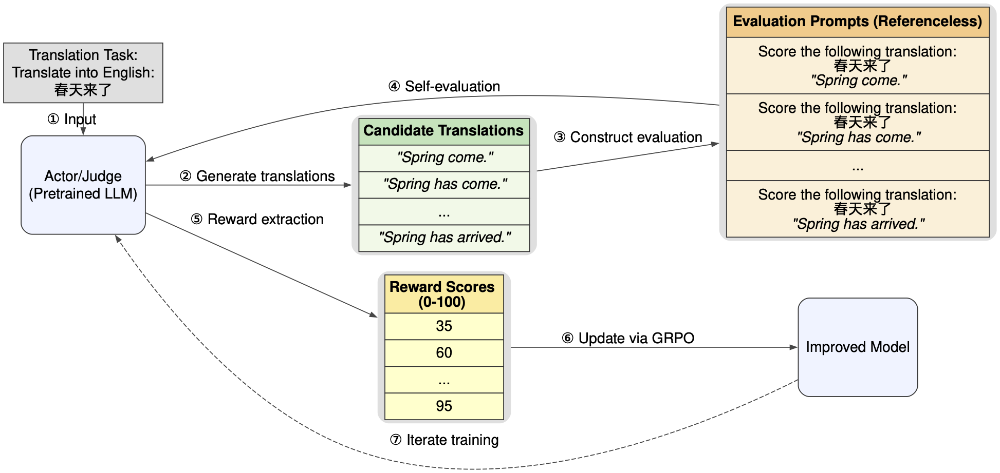

<h1>💫SSR-Zero: Simple Self-Rewarding Reinforcement Learning for Machine Translation</h1>

## Overview
We introduce a Simple Self-Rewarding (💫**SSR**) Reinforcement Learning (RL) approach for machine translation (MT). Using SSR training, our models **SSR-Zero-7B** and **SSR-X-Zero-7B** show state-of-the-art performance among open-source models under 72B parameters in English-to-Chinese and Chinese-to-English translation tasks. This is based on evaluations using WMT23, WMT24, and Flores200 benchmarks using automatic evaluation metics XCOMET-XXL and COMETKIWI-XXL.

💫SSR is a highly effective training approach that **doesn't need external supervision from human reference data or trained reward models**. It relies solely on the training model's own judgment to improve itself. For more details, please [check our paper on arXiv](https://arxiv.org/abs/2505.16637).

👷Note that this repository is still under construction, and more content will be added soon.

## Releases 📰
[2025-05-23] We've released our models [SSR-Zero-7B](https://huggingface.co/wjyccs/SSR-Zero-7B) and [SSR-X-Zero-7B](https://huggingface.co/wjyccs/SSR-X-Zero-7B) on Hugging Face!

### Results
We report our results measured by [COMETKIWI-XXL](https://huggingface.co/Unbabel/wmt23-cometkiwi-da-xxl) and [XCOMET-XXL](https://huggingface.co/Unbabel/XCOMET-XXL) using the [COMET library](https://github.com/Unbabel/COMET).
#### Comparison with Open-Source LLMs
<table>
  <thead>
    <tr>
      <th rowspan="3">Models</th>
      <th colspan="7">ZH→EN</th>
      <th></th>
      <th colspan="7">EN→ZH</th>
    </tr>
    <tr>
      <th colspan="2">WMT23</th>
      <th colspan="2">WMT24</th>
      <th colspan="2">Flores200</th>
      <th rowspan="2">Avg.</th>
      <th></th>
      <th colspan="2">WMT23</th>
      <th colspan="2">WMT24</th>
      <th colspan="2">Flores200</th>
      <th rowspan="2">Avg.</th>
    </tr>
    <tr>
      <th>COMETKIWI</th><th>XCOMET</th>
      <th>COMETKIWI</th><th>XCOMET</th>
      <th>COMETKIWI</th><th>XCOMET</th>
      <th></th>
      <th>COMETKIWI</th><th>XCOMET</th>
      <th>COMETKIWI</th><th>XCOMET</th>
      <th>COMETKIWI</th><th>XCOMET</th>
    </tr>
  </thead>
  <tbody>
    <tr><td colspan="16"><b>General Purpose LLMs</b></td></tr>
    <tr>
      <td>Qwen3-32B (thinking mode)</td>
      <td>79.74</td><td>90.79</td><td>79.20</td><td>88.47</td><td>87.68</td><td>95.75</td><td>86.94</td><td></td>
      <td>76.94</td><td>89.75</td><td>76.96</td><td>84.10</td><td>87.45</td><td>92.18</td><td>84.56</td>
    </tr>
    <tr>
      <td>Qwen3-32B</td>
      <td>80.28</td><td>91.95</td><td>79.95</td><td>89.53</td><td>88.88</td><td>97.18</td><td>87.96</td><td></td>
      <td>79.27</td><td>91.28</td><td>79.51</td><td>86.63</td><td>89.69</td><td>94.07</td><td><strong>86.74</strong></td>
    </tr>
    <tr>
      <td>Qwen3-8B (thinking mode)</td>
      <td>78.30</td><td>89.03</td><td>77.99</td><td>86.94</td><td>85.82</td><td>93.89</td><td>85.33</td><td></td>
      <td>74.94</td><td>88.22</td><td>75.39</td><td>82.25</td><td>86.08</td><td>91.02</td><td>82.98</td>
    </tr>
    <tr>
      <td>Qwen3-8B</td>
      <td>79.87</td><td>91.42</td><td>79.58</td><td>89.02</td><td>88.61</td><td>96.55</td><td>87.51</td><td></td>
      <td>78.59</td><td>90.90</td><td>78.71</td><td>85.31</td><td>88.90</td><td>93.30</td><td>85.95</td>
    </tr>
    <tr>
      <td>Qwen2.5-72B-Instruct</td>
      <td>80.62</td><td>92.14</td><td>80.46</td><td>90.06</td><td>88.90</td><td>97.28</td><td>88.24</td><td></td>
      <td>78.18</td><td>91.34</td><td>78.18</td><td>85.13</td><td>88.04</td><td>93.20</td><td>85.68</td>
    </tr>
    <tr>
      <td>Qwen2.5-32B-Instruct</td>
      <td>77.73</td><td>89.28</td><td>78.77</td><td>88.69</td><td>87.13</td><td>95.50</td><td>86.18</td><td></td>
      <td>77.73</td><td>90.23</td><td>78.77</td><td>83.48</td><td>87.13</td><td>91.99</td><td>84.89</td>
    </tr>
    <tr>
      <td>Qwen2.5-7B-Instruct</td>
      <td>77.56</td><td>89.40</td><td>76.71</td><td>87.12</td><td>86.28</td><td>94.06</td><td>85.19</td><td></td>
      <td>73.81</td><td>88.11</td><td>72.98</td><td>80.93</td><td>85.18</td><td>89.90</td><td>81.82</td>
    </tr>
    <tr>
      <td>QwQ-32B</td>
      <td>74.61</td><td>85.12</td><td>75.08</td><td>84.34</td><td>80.88</td><td>89.21</td><td>81.54</td><td></td>
      <td>77.33</td><td>89.10</td><td>78.13</td><td>85.03</td><td>86.51</td><td>90.93</td><td>84.51</td>
    </tr>
    <tr>
      <td>Gemma2-27B-it</td>
      <td>80.32</td><td>91.96</td><td>79.42</td><td>89.14</td><td>88.64</td><td>96.72</td><td>87.70</td><td></td>
      <td>76.95</td><td>90.50</td><td>77.38</td><td>84.17</td><td>87.79</td><td>92.51</td><td>84.88</td>
    </tr>
    <tr>
      <td>Gemma2-9B-it</td>
      <td>79.86</td><td>91.21</td><td>79.25</td><td>88.41</td><td>88.32</td><td>96.25</td><td>87.22</td><td></td>
      <td>75.22</td><td>89.66</td><td>74.15</td><td>81.65</td><td>85.95</td><td>90.90</td><td>82.92</td>
    </tr>
    <tr><td colspan="16"><b>MT-Specific LLMs</b></td></tr>
    <tr>
      <td>TowerInstruct-7B-v0.2</td>
      <td>77.78</td><td>89.13</td><td>76.96</td><td>85.98</td><td>86.95</td><td>94.88</td><td>85.28</td><td></td>
      <td>73.53</td><td>87.46</td><td>70.87</td><td>77.53</td><td>84.39</td><td>88.57</td><td>80.39</td>
    </tr>
    <tr>
      <td>TowerInstruct-13B-v0.1</td>
      <td>78.53</td><td>89.90</td><td>77.57</td><td>87.12</td><td>87.30</td><td>95.80</td><td>86.04</td><td></td>
      <td>75.56</td><td>89.28</td><td>73.81</td><td>80.81</td><td>86.22</td><td>90.69</td><td>82.73</td>
    </tr>
    <tr>
      <td>DeepTrans-7B</td>
      <td>/</td><td>/</td><td>/</td><td>/</td><td>/</td><td>/</td><td>/</td><td></td>
      <td>80.01</td><td>89.00</td><td>78.89</td><td>83.85</td><td>89.23</td><td>92.85</td><td>85.64</td>
    </tr>
    <tr>
      <td>GemmaX2-28-9B-v0.1</td>
      <td>79.40</td><td>90.63</td><td>78.71</td><td>88.60</td><td>87.85</td><td>96.33</td><td>86.92</td><td></td>
      <td>77.10</td><td>90.68</td><td>75.88</td><td>83.33</td><td>87.58</td><td>92.83</td><td>84.57</td>
    </tr>
    <tr><td colspan="16"><b>Ours</b></td></tr>
    <tr>
      <td>Qwen2.5-7B</td>
      <td>62.62</td><td>75.69</td><td>69.04</td><td>77.33</td><td>73.62</td><td>85.54</td><td>73.97</td><td></td>
      <td>68.25</td><td>81.63</td><td>64.28</td><td>69.48</td><td>82.00</td><td>86.07</td><td>75.29</td>
    </tr>
    <tr>
      <td>SSR-Zero-7B💫</td>
      <td>79.29</td><td>92.04</td><td>79.04</td><td>89.19</td><td>87.97</td><td>96.70</td><td><strong>87.37</strong></td><td></td>
      <td>79.69</td><td>91.18</td><td>79.34</td><td>85.34</td><td>89.25</td><td>93.52</td><td><strong>86.39</strong></td>
    </tr>
    <tr>
      <td>SSR-X-Zero-7B💫</td>
      <td>80.62</td><td>91.92</td><td>80.56</td><td>89.42</td><td>88.84</td><td>96.62</td><td><u><strong>88.00</strong></u></td><td></td>
      <td>81.11</td><td>91.56</td><td>79.67</td><td>86.75</td><td>90.08</td><td>93.98</td><td><u><strong>87.19</strong></u></td>
    </tr>
  </tbody>
</table>

#### Comparison with Closed-Source LLMs
<table>
  <thead>
    <tr>
      <th rowspan="3">Models</th>
      <th colspan="7">ZH→EN</th>
      <th></th>
      <th colspan="7">EN→ZH</th>
    </tr>
    <tr>
      <th colspan="2">WMT23</th>
      <th colspan="2">WMT24</th>
      <th colspan="2">Flores200</th>
      <th rowspan="2">Avg.</th>
      <th></th>
      <th colspan="2">WMT23</th>
      <th colspan="2">WMT24</th>
      <th colspan="2">Flores200</th>
      <th rowspan="2">Avg.</th>
    </tr>
    <tr>
      <th>COMETKIWI</th><th>XCOMET</th>
      <th>COMETKIWI</th><th>XCOMET</th>
      <th>COMETKIWI</th><th>XCOMET</th>
      <th></th>
      <th>COMETKIWI</th><th>XCOMET</th>
      <th>COMETKIWI</th><th>XCOMET</th>
      <th>COMETKIWI</th><th>XCOMET</th>
    </tr>
  </thead>
  <tbody>
    <tr>
      <td>Claude-3.5-Sonnet</td>
      <td>81.61</td><td>93.06</td><td>81.06</td><td>90.54</td><td>89.41</td><td>97.68</td><td><strong><u>88.89</u></strong></td><td></td>
      <td><strong>80.15</strong></td><td>92.00</td><td>80.00</td><td>86.31</td><td>89.47</td><td>94.32</td><td><u>87.04</u></td>
    </tr>
    <tr>
      <td>GPT-4o</td>
      <td>80.92</td><td>92.15</td><td>79.90</td><td>89.06</td><td>88.94</td><td>96.50</td><td>87.91</td><td></td>
      <td>76.71</td><td>88.56</td><td>77.42</td><td>83.95</td><td>88.30</td><td>93.30</td><td>84.71</td>
    </tr>
    <tr>
      <td>Gemini-1.5-Pro</td>
      <td>80.71</td><td>92.44</td><td>79.02</td><td>88.90</td><td>88.15</td><td>97.32</td><td>87.76</td><td></td>
      <td>79.80</td><td>91.95</td><td>79.54</td><td>87.11</td><td>89.30</td><td>94.54</td><td><u>87.04</u></td>
    </tr>
    <tr><td colspan="16"><b>Ours</b></td></tr>
    <tr>
      <td>SSR-Zero-7B💫</td>
      <td>79.29</td><td>92.04</td><td>79.04</td><td>89.19</td><td>87.97</td><td>96.70</td><td>87.37</td><td></td>
      <td>79.69</td><td>91.18</td><td>79.34</td><td>85.34</td><td>89.25</td><td>93.52</td><td>86.39</td>
    </tr>
    <tr>
      <td>SSR-X-Zero-7B💫</td>
      <td>80.62</td><td>91.92</td><td>80.56</td><td>89.42</td><td>88.84</td><td>96.62</td><td><u><strong>88.00</strong></u></td><td></td>
      <td>81.11</td><td>91.56</td><td>79.67</td><td>86.75</td><td>90.08</td><td>93.98</td><td><u><strong>87.19</strong></u></td>
    </tr>
  </tbody>
</table>